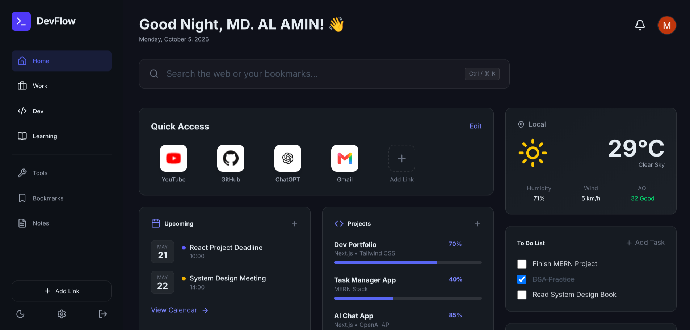
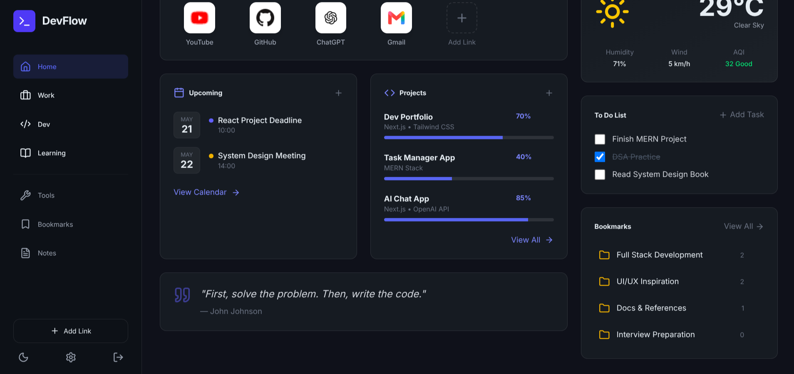

# DevFlow Extension

<p align="center">
  
  
</p>

A beautifully designed, personal developer dashboard that replaces your Chrome New Tab page. Built with HTML, Tailwind CSS, and vanilla JavaScript. Features offline-first real-time cloud syncing via Firebase Firestore.

## Features

- **Quick Links**: Fast access to your most used sites with auto-fetching favicons.
- **Projects & Progress**: Track your side projects and active learning goals with progress bars.
- **Todos**: Keep track of your daily tasks.
- **Bookmark Folders**: Organize references and docs perfectly.
- **Weather Widget**: Real-time localized weather via IP-based geolocation.
- **Developer Tools**: Quick launch panel for regex, GitHub, and StackOverflow.
- **Profiles**: Switch contexts between Home, Work, Dev, and Learning mode instantly.
- **Cloud Sync (Local-First)**: Blazing fast offline support with background syncing to Firebase. Log in with Google to sync your dashboard across all your devices.

## Tech Stack

- **Frontend**: HTML5, CSS3, Vanilla JS
- **Styling**: Tailwind CSS (v4)
- **Icons**: Lucide Icons
- **Backend & Auth**: Firebase Firestore & Firebase Auth (Google Sign-In)
- **Bundler**: ESBuild (for Manifest V3 compliance)

## Installation (For Users)

Since this extension is not on the Chrome Web Store yet, you can install it manually:

1. Download or clone this repository to your computer.
2. Open Chrome and go to `chrome://extensions/`.
3. Turn on **Developer mode** in the top right corner.
4. Click **Load unpacked** in the top left corner.
5. Select the `Devflow_extension` folder.
6. Open a new tab and enjoy!

## Development & Building

If you want to modify the code, you will need to recompile the CSS and JS bundles.

### Prerequisites
- Node.js & npm installed

### Setup
1. Clone the repository
2. Run `npm install` to install the build tools (ESBuild).

### Build Commands
We use ESBuild to bundle the Firebase SDK locally, and the standalone Tailwind CLI for CSS.

```bash
# Build both JS and CSS
npm run build

# Build only JS
npm run build:js

# Build only CSS
npm run build:css
```

## Security & Privacy
- **No Tracking**: DevFlow has zero telemetry or tracking.
- **Secure Sync**: All cloud syncing is strictly restricted by Firebase Security Rules ensuring that only you can read or write your own data.
- **XSS Protection**: All user-generated content is sanitized and escaped before rendering.
